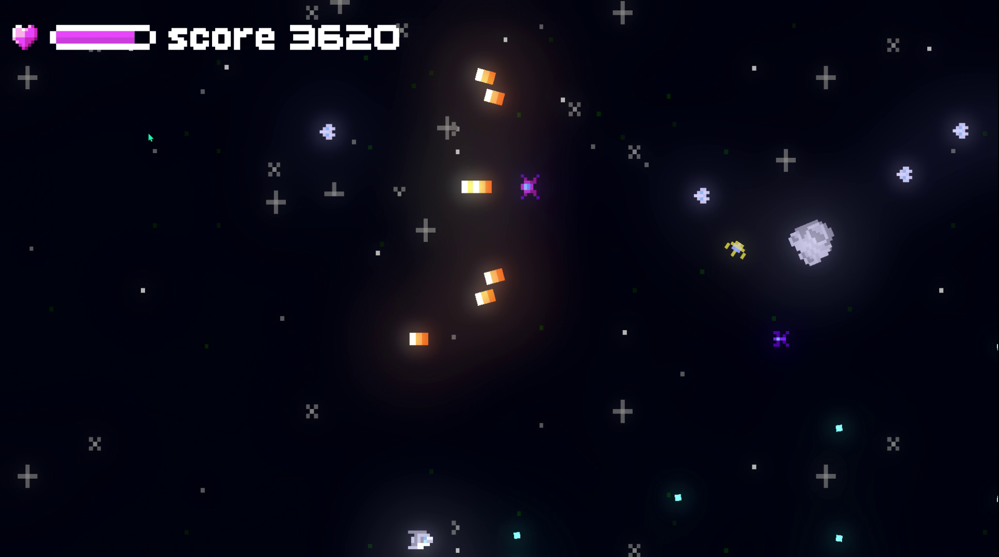
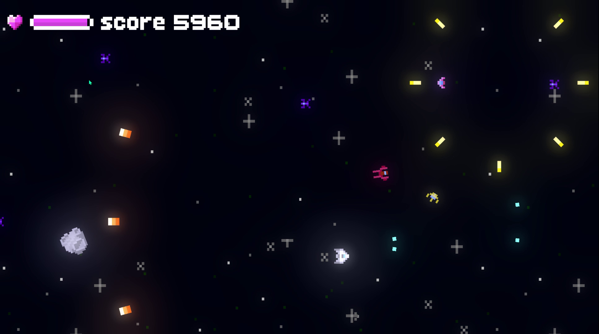
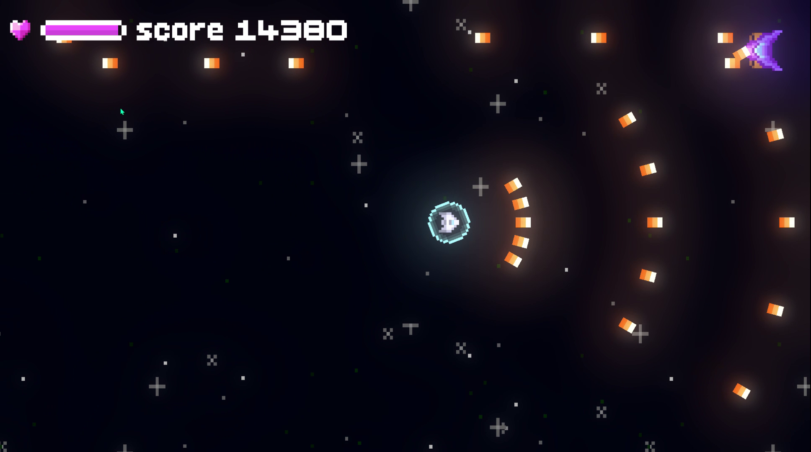
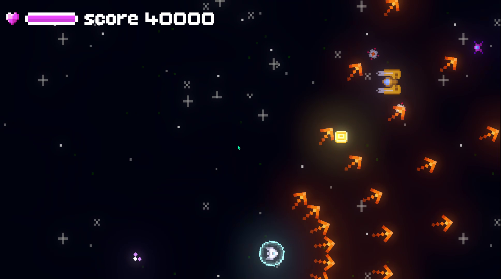

# Void Raiders

A small retro spaceship game made in an afternoon, just for fun.
A wave-based space shooter where you’ll have to take down countless enemies to earn power-ups that help you survive as long as possible.
Alongside regular enemies, bosses will appear on certain waves to truly test your reflexes and skill.

Try to stay alive as long as you can and reach the highest score!

Controls:
* Arrows - Move
* Z - Shoot

## Assets
* [Musica](https://opengameart.org/content/8-bit-epic-space-shooter-music)
* [Font](https://yukipixels.itch.io/boldpixels)
* [Sprites](https://gvituri.itch.io/space-shooter)
